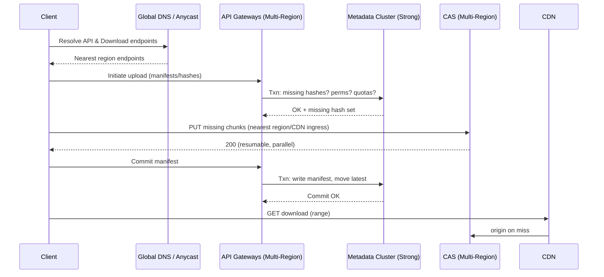

# Cloud Drive (Google-Drive–style) – Principal-Level System Design

## 📌 Executive Summary (5 lines)
- **Architecture:** Global control plane for **metadata (strongly consistent)** + multi-region **content plane** on content-addressable object storage with **erasure coding** and **tiering (hot/warm/cold)**.
- **Sync & Deltas:** **Content-Defined Chunking (CDC)** + **rolling hashes (Rabin/Karp)**, **dedup**, and **delta sync** (server tells client which chunks to upload) with **parallel resumable uploads**.
- **Collaboration & Conflicts:** Docs-style **real-time (CRDT/OT)**; binary files use **MVCC** + conflict branches; **notifications** via Pub/Sub and push to clients.
- **Security & Compliance:** **Per-blob envelope encryption (AES-GCM)**, **KMS-backed keys**, **ACLs/Link tokens**, **malware scanning**, and **audit trails**.
- **Scale & SLOs:** **10^11 objects**, **PB–EB storage**, p95 **<100 ms** metadata ops, **multi-region RPO≈0/RTO<15m** for metadata, CDN-accelerated downloads.

---

## 1) Goals & Non-Goals
**Goals**
- Efficient sync: **don’t reupload entire files on small changes**.
- Cross-device consistency, offline support, resumable uploads/downloads.
- Secure sharing (users, groups, domains), link-based sharing, and auditability.
- Massive scale (hundreds of millions of users, billions of files).
- Rich search (name, content OCR, file type), previews, version history, restore.

**Non-Goals**
- Full Google Docs editor design (we’ll integrate with a collab engine, not re-invent it).
- Source-control semantics (branches/merges across millions of lines). We provide MVCC + conflict files.

---

## 2) High-Level Architecture

```mermaid
flowchart TB
  subgraph ClientSide["Clients (Desktop/Mobile/Web)"]
    Watcher[FS Watcher] --> Delta[Chunker + Rolling Hash]
    Delta --> Session[Resumable Upload/Download]
    ClientCache[(Local chunk cache)]
  end

  subgraph ControlPlane["Global Control Plane (Strong Consistency)"]
    API[API Gateway] --> Auth[AuthZ/OIDC + Quotas]
    Auth --> MetaSvc[Metadata Service (Spanner-like, MVCC)]
    MetaSvc --> Index[Search/Indexing (text/OCR/tags)]
    MetaSvc --> Notif[Notifications (Pub/Sub -> Push/SSE)]
  end

  subgraph ContentPlane["Content Plane (Eventual, Highly Available)"]
    CAS[Content Addressable Store (Object Storage)]
    RS[Erasure Coding + Replication]
    CDN[CDN/Edge Cache]
    Scan[Malware/AV Pipeline]
  end

  ClientSide -- HTTPS/gRPC --> API
  ClientSide -- chunk PUT/GET --> CDN
  CDN --> CAS
  CAS --> RS
  CAS --> Scan
  MetaSvc <--> CAS
  Notif --> ClientSide
```

**Key separation:**  
- **Metadata** (directories, versions, ACLs, pointers to chunks) requires **strong global consistency** → built on a **Spanner-like store** (TrueTime/atomic clocks, or Spanner/Cloud Spanner/CosmosDB w/ multi-region strong).  
- **Content blobs** (chunks) stored in **content-addressable storage (CAS)**: key = **hash(chunk)**; replicated/erasure-coded across regions; **eventual consistency** is OK because metadata pins a specific content hash.

---

## 3) Storage Model & Versioning

### 3.1 Content-Addressable Storage (CAS)
- **Chunk = content-defined segment** (2–8 MB typical; variable-size via Rabin fingerprints to reduce boundary churn on edits).
- **Key:** `SHA-256(chunk)`; **immutable**, dedup-friendly.
- **File version** = **manifest**: ordered list of chunk hashes + sizes + file attributes (MIME, xattrs).
- **Folder** = metadata nodes referencing child IDs + ACLs + sort keys.

### 3.2 Versioning & MVCC
- Every file update creates a new **manifest record** (append-only).  
- **Latest pointer** moves atomically in metadata (transaction).  
- Older manifests retained per **retention policy**; GC unpinned chunks with refcount=0.

### 3.3 Erasure Coding & Tiers
- **Hot tier** (recent, frequently accessed): RS (e.g., **RS(10,4)**) in 3 regions; CDN cached.  
- **Warm tier**: reduced replication, colder RS parity.  
- **Cold/Archive**: Glacier/Deep Archive with async restore SLA.  
- **Auto-tiering** based on access patterns.

---

## 4) Sync Without Reuploading Whole Files

### 4.1 On the Client
1. **Watcher** detects changes (inotify/FSEvents/USN Journal).  
2. **CDC Chunker** splits content using **rolling hash (Rabin)** → stable boundaries.  
3. For each chunk:
   - Compute **SHA-256**.  
   - Check **local cache**; build a **Bloom filter** of hashes to query server efficiently.
4. **Upload negotiation:** client sends the set of needed chunk hashes → **server replies with missing hashes**.
5. **Parallel resumable uploads** for missing chunks (HTTP/2 or gRPC, N streams).
6. Submit updated **manifest** to Metadata Service in a transaction.

### 4.2 On the Server
- **Dedup:** if `SHA-256` exists, **no write**; else write to CAS.  
- **Atomicity:** manifest write + “latest pointer” update in the same metadata txn.  
- **Malware scan** async; if malicious, mark version quarantined (blocked from download except owner/admin), notify.

### 4.3 Delta for Small Edits
- CDC ensures **only changed regions** turn into new chunks.  
- Example: insert 1 KB at head of a 100 MB file → only a handful of downstream chunks re-align; we upload perhaps ~2–4 MB, not 100 MB.

**Optional enhancement:** for large binary formats, add **rsync-style rolling checksum inside chunks** (sub-chunk delta) or **binary diff (bsdiff/xdelta)** for extra savings; trade-off with CPU.

---

## 5) Consistency & Collaboration

### 5.1 Consistency model
- **Metadata:** **strong global consistency** (linearizable) for pointers, ACL updates, moves/renames, shares.  
- **Content:** immutable chunks in CAS, **eventual** across regions; safe because metadata references **hashes** (content-ID).

### 5.2 Conflicts
- **Binary files:** MVCC; if two writers update concurrently, keep **two versions**; generate a **“conflicted copy”** and notify.  
- **Docs/Sheets-style realtime:** integrate **CRDT/OT service** for operational transforms; state deltas streamed via WebSocket/QUIC; periodic checkpoints persist to CAS.

---

## 6) Sharing, ACLs, Links
- **ACLs** on folders/files: (user, group, domain) × (owner, editor, commenter, viewer).  
- **Link sharing:** time-scoped tokens; **signed URLs** for CDN downloads; **view-only** overlays for web preview.  
- **Audit trails:** who accessed, when, IP/device; immutable append log in a separate audit store.

---

## 7) APIs (sketch)
- `POST /files/initiate-upload` → returns upload session + list of **missing chunk hashes**.  
- `PUT /chunks/{sha256}` (resumable) → store new chunk.  
- `POST /files/{fileId}/commit` → commit new manifest (txn).  
- `GET /files/{fileId}` → metadata + latest manifest.  
- `GET /download/{fileId}?v=manifestId` → **range-supported** streaming via CDN.  
- `POST /share/{fileId}` → set ACLs or create link token.  
- **Events:** Pub/Sub channel for “file updated/shared/commented” push.

---

## 8) Search & Indexing
- **Content indexers** run async:  
  - Text extraction (PDF, Office), **OCR** for images, **thumbnail generation**, AV scanning.  
  - Metadata & text into **inverted index** (Elasticsearch/OpenSearch/Vertex/Custom).  
- **Signals** (owner, last viewer, frequency) feed ranking; **privacy** preserved (respect ACLs in query time with **filtering at index shard**).

---

## 9) Observability, SLOs & Scale

**SLOs**
- Metadata ops p95 **<100 ms**, p99 **<250 ms**.  
- Upload resume **<3 s** after network drop; download throughput **CDN edge-optimal**.  
- Cross-region metadata RPO≈0, RTO<15m.  

**Telemetry**
- RED/USE metrics on API, sync agent; **distributed tracing** (OpenTelemetry); **synthetic probes** per region.  
- **Capacity KPIs:** CAS read/write QPS, hot chunk hit-rate, dedup ratio, erasure coding overhead, CDN offload %, scan lag.

---

## 10) Multi-Region & DR



- **Metadata**: multi-region **strong** (Spanner-like) → leaderless writes with TrueTime or Paxos/Raft per shard; global reads/writes consistent.  
- **CAS**: replicated/erasure across ≥3 regions; **eventual** is fine.  
- **CDN**: edge for download; **signed URLs**; cache-control tuned.  
- **Backups**: immutable snapshots of metadata + CAS manifests to cold storage; **object lock/WORM** for compliance.

---

## 11) Security & Compliance
- **Encryption at rest:** per-chunk data keys (AES-GCM), wrapped by **KMS** (envelope).  
- **Encryption in transit:** TLS 1.3; **mutual TLS** for internal services.  
- **Zero-trust** service mesh (mTLS, JWT/Spiffe).  
- **Malware scanning** before exposure; quarantine flags; detonation sandbox for suspicious office docs.  
- **DLP policies:** prevent public sharing of sensitive tags; domain-wide controls.  
- **PII/region residency:** data placement policies & **sovereign partitions**; metadata masking.

---

## 12) Failure Modes & Resilience

- **Client network flaps** → resumable sessions + exponential backoff; chunk re-tries idempotent (keyed by hash).  
- **Hot files (popular share)** → CDN + regional caches; **request coalescing** at origin; **token bucket** rate-limits.  
- **CAS region outage** → read from other regions; writes queue; **async repair**.  
- **Metadata partial outage** → shard-level failover; **graceful degrade** to read-only if needed.  
- **Scanner backlog** → serve file with “scan pending” banner (policy-controlled).  

---

## 13) Worth-Noting Algorithms & Data Structures
- **Content-Defined Chunking (CDC)** via **Rabin fingerprints** → stable chunk boundaries under inserts/deletes.  
- **Rolling checksums** + **SHA-256** for chunk identity and integrity.  
- **Erasure coding** (**Reed-Solomon**) for storage efficiency vs 3× replication.  
- **CRDT/OT** for real-time document collaboration (Docs).  
- **MVCC** for file metadata (rename, move, latest pointer).  
- **Bloom filters** to compactly tell server what the client has (and vice-versa).  
- **Inverted indexes** + **OCR** for search.  
- **Rate-limiters** (token bucket) and **singleflight** to prevent stampedes.

---

## 14) Example Flows

### 14.1 Small Edit Upload (delta)
1. Client CDC → hashes chunks.  
2. `POST /files/initiate-upload` with list of chunk hashes.  
3. Server responds with **missing hashes**.  
4. Client **PUT** only missing chunks (parallel, resumable).  
5. `POST /commit` new manifest (txn); notify collaborators.

### 14.2 Download (partial/range)
- Client `GET /download?id=X&v=manifest` with **Range** → CDN streams only needed chunks; supports video scrubbing and preview thumbnails.

---

## 15) Trade-offs & Alternatives
- **CDC vs fixed-size chunks:** CDC saves bandwidth on inserts; fixed-size is simpler & CPU cheaper. We can hybrid: fixed 4MB with CDC around known hot formats.  
- **Strong metadata vs eventual:** Strong costs more latency cross-region but simplifies sharing correctness; we accept it for UX.  
- **Erasure coding vs 3× replication:** EC cuts cost but increases rebuild time and CPU; hot tier may use 2×+EC or pure replication.  
- **CRDT vs file locks:** CRDT for docs; locks for binary design files (optional).  
- **Client privacy vs server search:** End-to-end encryption reduces server-side features (OCR, search); offer **E2EE folders** as an opt-in with local indices.

---

## 16) Pseudocode Sketches

### 16.1 Upload Negotiation (client)
```pseudo
chunks = CDC(fileBytes)              // variable-size chunks
hashes = [SHA256(c) for c in chunks]
resp = POST /files/initiate-upload {hashes}
missing = resp.missing_hashes
parallel_for h in missing:
  PUT /chunks/{h} (resumable upload bodyFor(h))
POST /files/{fileId}/commit { manifest: hashes, attrs }
```

### 16.2 Manifest Commit (server, transactional)
```pseudo
txn {
  assert(ACL.allows(user, WRITE, fileId))
  for h in manifest.hashes:
    assert(CAS.exists(h))            // or durable write completed
  newVersionId = insert(manifest)
  set file.latestVersion = newVersionId
  enqueue(notify(fileId, newVersionId))
}
```

---

## 17) What I’d Say in a Principal Review
> **We separate metadata (strong) from content (eventual)**; that lets us give users correct sharing & version pointers while scaling blob storage cheaply. **CDC + rolling hashes** and **CAS** ensure we upload only changed chunks, with global **dedup** and **resumable parallel uploads**. We **pre-sign CDN downloads** for edge performance, and use **erasure coding** + **tiering** to control cost. Collaboration uses **CRDT/OT** for realtime docs; binaries rely on **MVCC + conflict copies**. The design is **multi-region active-active**, **KMS-encrypted**, auditable, and resilient to hot keys, outages, and scanner backlog. Our SLIs/SLOs and runbooks close the loop on operability.

---
